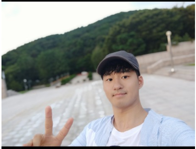
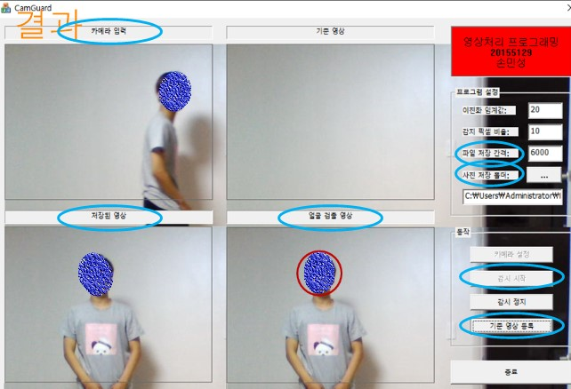
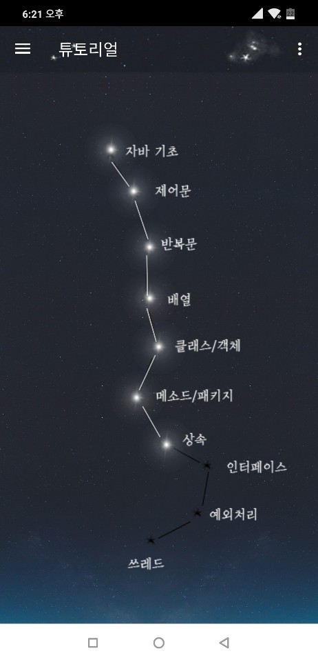

## 소개

- 이름: 손민성
- 군필여부: 현역 예비군
- 취미: 웹크롤링,NLP,엑셀프로그래밍
- Email: iconms12@naver.com

```
현재 빅데이터 공학과에서 딥러닝 관련으로 수강하고있습니다.

```
## 학력
- 한림대학교 빅데이터 공학과 재학중
---

## 보유중인 자격증
- 정보처리 기능사
- GTQ
- ITQ
- 정보기기 운용 기능사
---
## 사용 언어
- Java
- Python
- C#
- C++
---
### Android
- Unity를 이용한 간단한 2D,3D게임 프로젝트를 진행하였습니다.

---
### Server
간단한 데이터베이스및 웹서버를 다루어 네트워크를 구축할수있습니다.
- 네이버 클라우드
- Firebase
- Azure
---
### TODO
**새로운것**을 배우는건 언제나 즐거운 일입니다. <br/>
현재는 아래것들을 익히고 있습니다.
- linux
- 클라우드 컴퓨팅

---

## 진행했던 프로젝트


### **C++를 사용한 도난경보 애플리케이션**
- C++


### **이미지 데이터를 String으로 바꾸어 분류문제 해결**
- python 3.6
- konlpy
- openCV


### **단순한 분류문제를 사용한 Q&A프로그램 제작**
- Python 3.7
- konlpy
- tensorflow



### **자바 학습 어플리케이션 프로그램 제작**
- Android studio
- javascript
- firebase

### **Unity를 이용한 3D 공포게임**
- Unity
- C#
- Maya
- firebase

### **Android studio를 이용한 랜덤채팅 애플리케이션**
- Android Studio
- java
- firebase
- Mysql

### realtime_crime_detection
[이동]<https://github.com/iconms12/Image_Captioning>

---

